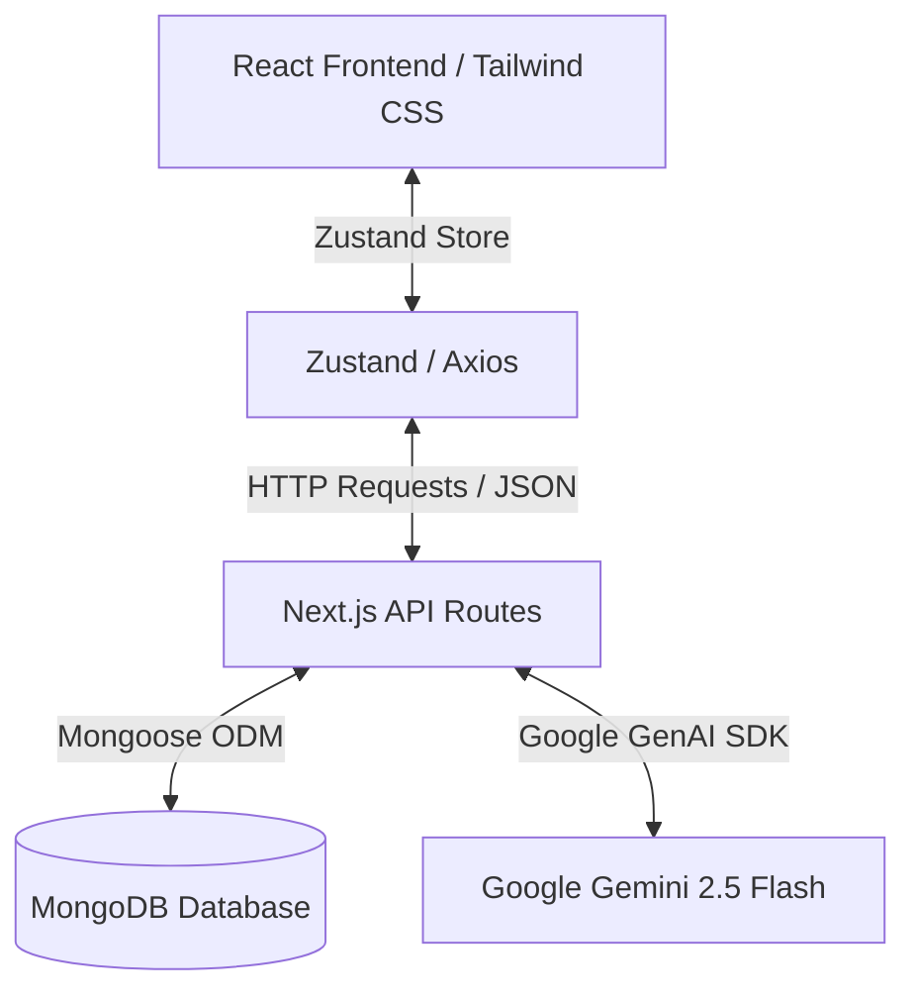

# Course Allocation System Architecture Document

This document explains the architecture design, database design decisions, AI integration approach, security considerations, and key challenges faced during the development of the Course Allocation System.

---

## 1. Architecture Design

The system follows a modern **Monolithic Next.js (App Router)** architecture, combining frontend views and serverless API endpoints into a single unified workspace.



### Key Architectural Layers:
1. **Frontend Presentation Layer (React & Tailwind CSS)**:
   - Handled via `app/page.js` rendering a modular `components/Dashboard.jsx` dashboard view.
   - Built with component-level forms (`components/StudentForm.jsx`, `components/CourseForm.jsx`) and panels (`components/AssistantPanel.jsx`).
   - Uses Tailwind CSS for responsive and elegant styling.

2. **Frontend State Management Layer (Zustand)**:
   - Orchestrated in `store/allocationStore.js`.
   - Centralizes loading states, error handling, local course/student cache, dashboard stats, and AI assistant query responses.
   - Restricts components from triggering raw API calls, leading to a predictable and clean data flow.

3. **Backend Service Layer (Next.js API Routes)**:
   - Implements RESTful HTTP controllers using Next.js route handlers (`app/api/**/*`).
   - Integrates Mongoose to handle database connections (`lib/db.js`) and models (`models/*`).
   - Performs validations and holds the logic for the allocation algorithm.

4. **Data Layer (MongoDB & Mongoose)**:
   - Schema validation, data normalization, database connections caching, and data indexing.

5. **AI Reasoning Layer (Google Gemini)**:
   - Integrated using `@google/genai` library pointing to `gemini-2.5-flash`.
   - Utilizes RAG (Retrieval-Augmented Generation) by feeding the structured dashboard data directly to the LLM to get accurate answers without hallucination.

---

## 2. Database Design Decisions

### Relational Modeling in NoSQL
While Course Allocation has implicit relationships (Students belong to a demographic and select Courses as preferences), MongoDB was chosen for its flexibility, horizontal scaling properties, and rapid developer velocity.
- **Reference-based relationships**: Mongoose `Schema.Types.ObjectId` and `ref` bindings are used for student preferences (`preference1`, `preference2`, `preference3`), pointing to the `Course` model. This allows flexible population on the server-side while keeping the database normalized.
- **Run Tracking Model**: Separating allocations into the `Allocation` schema and allocation runs into the `AllocationRun` schema allows history tracking. Rather than overwriting a student's record directly, the system creates allocation entries tied to an `AllocationRun` document. This enables auditing, re-running, and comparisons.

### Indexes for High-Performance Queries
In a real-world scenario with thousands of students, sorting for merit list processing is highly resource-intensive.
- In `models/Student.js`:
  ```javascript
  studentSchema.index({ marks: -1, applicationDate: 1 });
  ```
  This compound index matches the exact sort order of the merit-allocation engine. It ensures sorting runs in $O(1)$ memory/index seek time, preventing expensive memory-sorting stages in MongoDB.
- In `models/Allocation.js`:
  ```javascript
  allocationSchema.index({ run: 1, student: 1 }, { unique: true });
  ```
  This compound index acts as a database-level integrity check, ensuring that no student gets multiple allocations within the same run.

---

## 3. AI Integration Approach

The system embeds an **AI Assistant** directly into the reporting panel. 

### Prompt-Injected Retrieval-Augmented Generation (RAG)
To guarantee that the AI remains truthful and only references the concrete database values, the backend API does the following:
1. Queries the MongoDB database to build a complete snapshot of the latest allocation run, including table outcomes, available seat splits, and rejection stats.
2. Formulates a prompt where the snapshot JSON data is appended to the system instructions.
3. Sets strict bounds:
   - Answer only from the provided JSON data.
   - Do not make up facts.
   - Fall back to a standard string `"I couldn't find that information."` if the request falls outside the dataset.
4. Leverages **Gemini 2.5 Flash** for its fast response speeds, low latency, and highly accurate structured data processing.

---

## 4. Security Considerations

1. **Environment Separation**: 
   - Sensitive keys like the MongoDB connection string and the Gemini API key are kept outside the code in `.env.local` and loaded strictly on the server side. They are never exposed to the frontend.
2. **Schema Sanitization**:
   - Backend routes parse data using Mongoose schema validation rules, sanitizing incoming student marks (limiting between 0 and 100), categories (general, OBC, SC, ST), and application timestamps.
3. **No Database Over-Exposure**:
   - The client only accesses aggregated results and formatted statistics from `/api/allocation/dashboard`, minimizing exposure of raw internal database object IDs and private fields.

---

## 5. Challenges Faced & Solutions Implemented

### Challenge 1: Ensuring Reservation Quota Integrity
**Problem**: The allocation algorithm must guarantee that reserved category students first compete for "Open" seats. If open seats are filled, they must fallback to their respective category quota (OBC, SC, ST). At the same time, general candidates must never consume reserved seats.
**Solution**: 
A dynamic `seatTracker` object is initialized at the start of the allocation run. For each student, the engine checks preferences sequentially. For each preferred course:
- The engine first attempts to allocate from the `open` seat pool.
- If `open === 0`, it verifies if the student category is not `General` and checks if the student's category pool (`seats[student.category]`) has available seats.
- This dual-lookup logic successfully replicates complex public reservation algorithms.

### Challenge 2: Client-Server Payload validation mismatches
**Problem**: Client inputs can bypass simple browser constraints (e.g. duplicating course selections in Student Preferences).
**Solution**:
Implemented defensive programming validation in the React layer (`components/StudentForm.jsx`), checking:
```javascript
if (new Set(selectedPreferences).size !== selectedPreferences.length) {
  alert("Please select different courses for each preference.");
  return;
}
```
And also validating seat balances on Course Creation, ensuring reserved seat sizes don't exceed the total capacity:
```javascript
const reservedTotal = obc + sc + st;
if (reservedTotal > totalSeats) {
  alert("Reserved seats cannot exceed total seats.");
  return;
}
```
This guarantees double-entry bookkeeping validation on both front and back ends.
